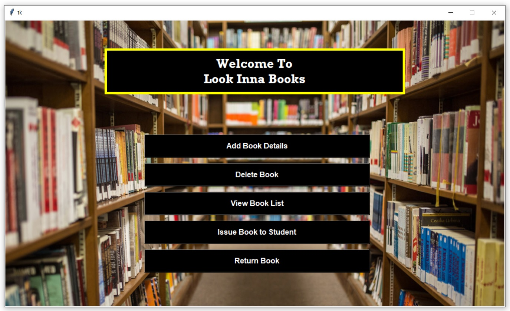
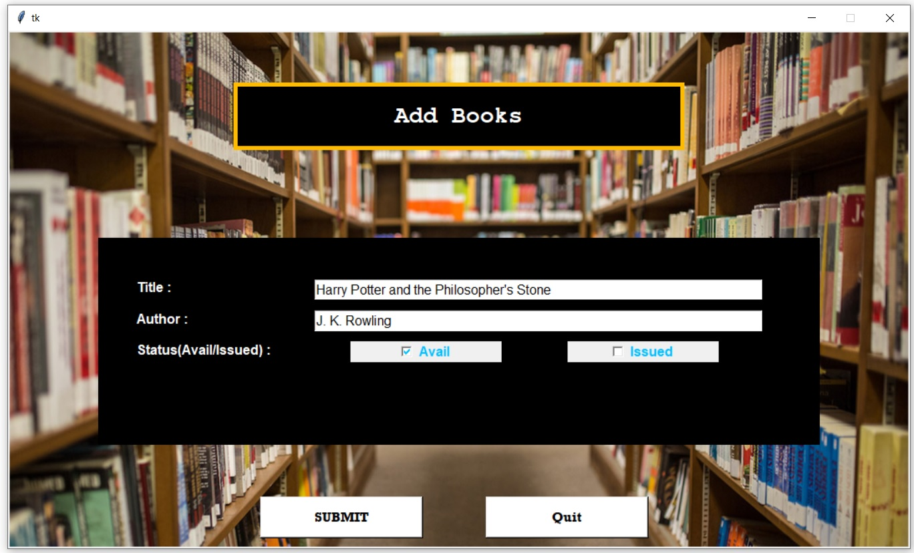
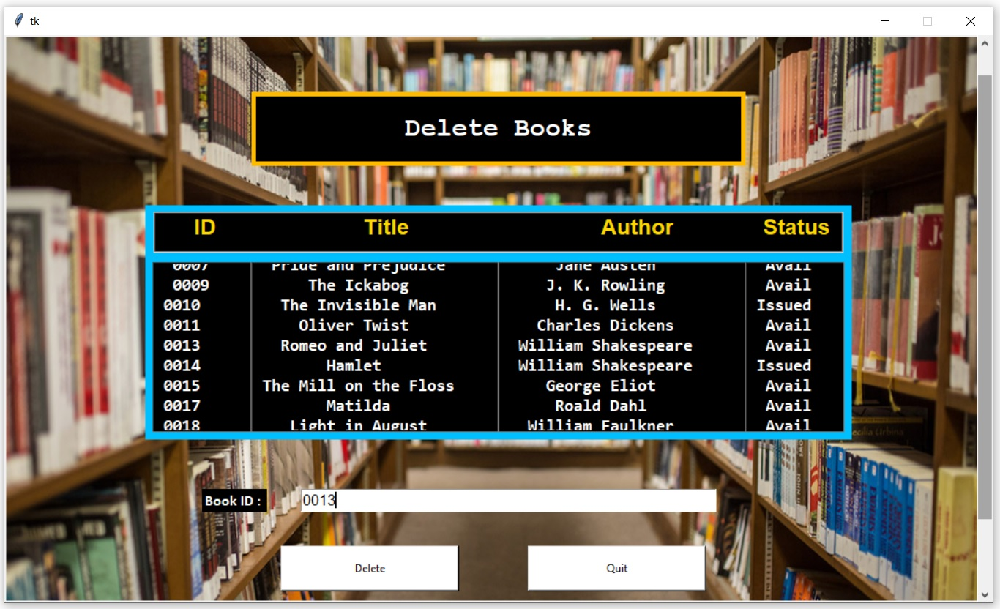
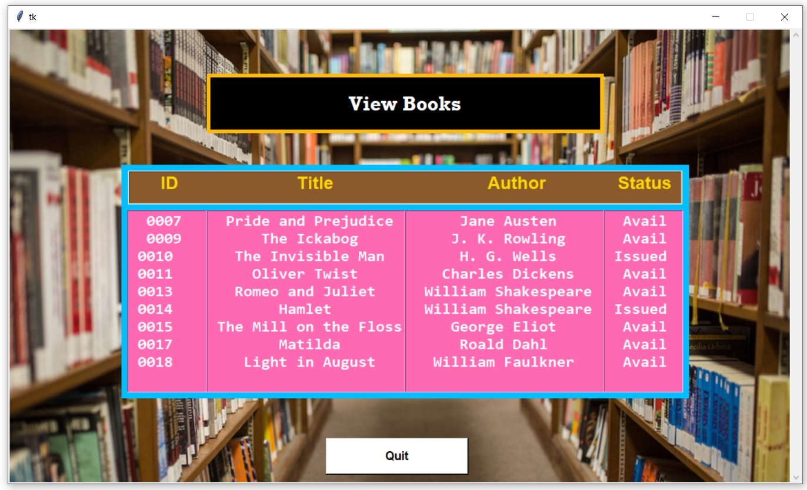

# Library-Management
This is a Python Project for a Book Store data using MySQL

App Screens
-------
| Home Screen    |
| ------------- |
|      |
|<h4> This is the home page which comes at the starting giving diffrent options in th Book Store  |
  
 
  
| Add Book Details |
| ------------- |
|       |
|<h4> You can add a new book by providing with Book title and author's Name  |

   
  
| Delete Book Details     |
| ------------- |
|       |
 |<h4> You can delete a book by providing with Book ID  |

     
  
| View Book Details       |
| ------------- |
|       |
